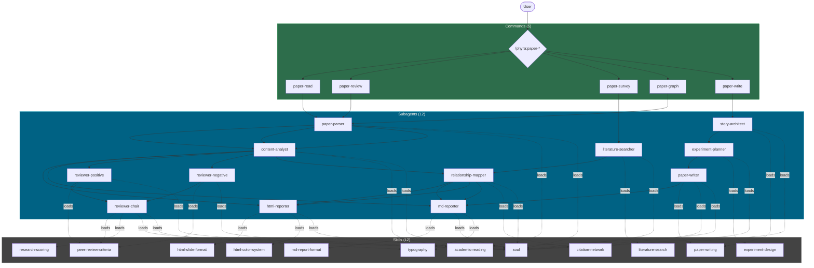

# Phyra

> Phyra draws its name from Epiphyllum, the night-blooming cereus -- a flower that blooms only in darkness and silence, vanishing before dawn. Like its namesake, Phyra is designed to do its work precisely, quietly, with every ounce of effort, and without excess. Though the flower fades, its fragrance lingers.

Maintainer: OrientoNubo
Contact: siyu@cmlab.csie.ntu.edu.tw

## About

Phyra is an academic research plugin for Claude Code, built on collaborative multi-agent architecture. It targets computer science and AI research, with primary support for Computer Vision, Machine Learning, and Deep Learning.

The project is composed of Skills, Subagents, and Commands, providing research assistance with reliability, self-verification, and systematic rigor.

**Important:** Phyra is a purely academic open-source project. Commercial use and any derived commercial activities are prohibited.

## Installation

> After installation, restart Claude Code for changes to take effect.

### Marketplace (Recommended)

```
/plugin marketplace add OrientoNubo/Phyra
/plugin install phyra@phyra
```

> **Troubleshooting:** If you encounter schema validation errors during install, they may come from other installed marketplaces. Run `/plugin marketplace remove claude-plugins-official` first, install Phyra, then re-add the official marketplace.

### Alternative: Plugin Directory

```bash
git clone https://github.com/OrientoNubo/Phyra.git
claude --plugin-dir ./Phyra
```

## Architecture



| Layer | Count | Role |
|---|---|---|
| Skills | 12 | Knowledge injection: reading frameworks, review criteria, scoring rubrics, search strategies, report formats, writing standards, typography rules, color system |
| Subagents | 12 | Specialized workers that load skills and execute tasks: parsing, analysis, reviewing, searching, mapping, reporting, writing, planning |
| Commands | 5 | User-facing entry points that orchestrate subagent pipelines |

## Execution Modes

Every command supports two execution modes:

**NT mode (default)** -- Sequential execution. Subagents run one after another in a fixed pipeline.

```
/phyra:paper-review paper.pdf
```

**AT mode (Agent Teams)** -- Parallel execution. Where the workflow allows, subagents run concurrently using Claude Code's Agent Teams feature.

```
/phyra:paper-review --at paper.pdf
```

To enable Agent Teams, add the following to `~/.claude/settings.json`:

```json
{
  "env": {
    "CLAUDE_CODE_EXPERIMENTAL_AGENT_TEAMS": "1"
  }
}
```

### NT vs AT Pipeline Example: /phyra:paper-review

**NT (Sequential):**

```
paper-parser -> content-analyst -> reviewer-positive -> reviewer-negative -> chair
```

**AT (Parallel):**

```
paper-parser -> content-analyst -> [reviewer-positive || reviewer-negative] -> chair
```

In AT mode, the two reviewers run in parallel and the chair can communicate directly with both reviewers to resolve disagreements.

## Components

### Commands

#### `/phyra:paper-read`

Systematic paper reading with the TP-V (Three-Pass Verification) framework. Outputs an interactive HTML slide report and structured Markdown reading notes.

```
/phyra:paper-read path/to/paper.pdf
/phyra:paper-read paper.md --at
```

**Pipeline:** paper-parser -> content-analyst -> html-reporter + md-reporter

#### `/phyra:paper-review`

Dual-reviewer peer review with an AC (Area Chair) process. Two independent reviewers (one constructive, one adversarial) each produce a review draft. A chair reconciles disagreements and writes a final peer review report with five-dimension scoring.

```
/phyra:paper-review path/to/paper.pdf
/phyra:paper-review paper.pdf --at
```

**Pipeline:** paper-parser -> content-analyst -> reviewer-positive + reviewer-negative -> chair

#### `/phyra:paper-survey`

Literature search and relationship mapping. Accepts a paper file, text description, task statement, or research topic as input. Searches the literature, analyzes relationships, and produces an HTML report with a force-directed relationship graph alongside a Markdown survey note.

```
/phyra:paper-survey "3D reconstruction from video streams"
/phyra:paper-survey path/to/seed-paper.pdf --at
```

**Pipeline:** literature-searcher -> relationship-mapper -> html-reporter + md-reporter

#### `/phyra:paper-graph`

Citation network and relationship graph from a list of papers. Accepts title lists, BibTeX files, or mixed formats. Analyzes each paper, maps relationships across the entire set, and outputs an interactive HTML visualization and Markdown notes.

```
/phyra:paper-graph paper-list.txt
/phyra:paper-graph references.bib --at
```

**Pipeline:** paper-parser -> content-analyst -> relationship-mapper -> html-reporter + md-reporter

#### `/phyra:paper-write`

End-to-end paper writing assistance, from storyline design through experiment planning to draft writing. Supports both starting from scratch and revising an existing draft.

```
/phyra:paper-write --from-scratch
/phyra:paper-write path/to/draft.tex
/phyra:paper-write draft.md --at
```

**Pipeline:** story-architect -> experiment-planner -> paper-writer -> md-reporter

### Skills

Skills are knowledge modules loaded by subagents. They are not invoked directly by users -- they are automatically loaded when the relevant subagent runs.

| Skill | Description |
|---|---|
| **soul** | Core reasoning philosophy: naturalistic ontology, BSEM aesthetics (Beauty, Simplicity, Elegance, Moderation), care-based ethics. Mandatory for all agents. |
| **typography** | Typography constraints applied to all output: no `——`, no `---` dividers, no 3-level nesting, no decorative bold. |
| **academic-reading** | Systematic paper reading framework (TP-V three-pass method): structure deconstruction, contribution identification, methodology evaluation. |
| **peer-review-criteria** | Peer review evaluation dimensions and flaw classification (Fatal / Major / Minor / Suggestion). |
| **research-scoring** | Five-dimension scoring rubric: Problem Validity (0.15), Method Soundness (0.30), Experimental Adequacy (0.30), Novelty (0.15), Reproducibility (0.10). |
| **literature-search** | Multi-source search strategies across arXiv, Semantic Scholar, Google Scholar, and domain-specific databases. |
| **citation-network** | Relationship type vocabulary (builds-on, contradicts, parallel, supersedes, applies, critiques) and citation graph construction rules. |
| **html-slide-format** | HTML slide report layout and structure specification. |
| **html-color-system** | 100-theme Japanese color palette from nipponcolors.com (42 light + 58 dark), three-layer CSS background, dropdown theme switcher. |
| **md-report-format** | Markdown report templates for each report type (reading notes, survey notes, graph notes, writing plan). |
| **paper-writing** | Academic writing standards: storyline construction, gap analysis, contribution claim formulation. |
| **experiment-design** | Experiment design norms: baseline selection, ablation design, evaluation metrics, hypothesis-driven planning. |

### Subagents

Subagents are specialized workers invoked by commands. They can also be used independently via the `/agents` interface.

| Subagent | Description | Key Skills |
|---|---|---|
| **paper-parser** | Parses PDF/LaTeX/MD/Word papers into structured content. The synchronous first step of all workflows. | academic-reading |
| **content-analyst** | Deep analysis: claim mapping, method logic chains, experimental sufficiency evaluation. | academic-reading |
| **peer-reviewer-positive** | Constructive reviewer. Identifies strengths, considers repair possibilities for each issue found. | peer-review-criteria |
| **peer-reviewer-negative** | Adversarial reviewer. Probes root causes behind surface problems, stress-tests methodology. | peer-review-criteria |
| **peer-reviewer-chair** | AC chair. Reads only review drafts (not the paper), reconciles disagreements, writes final reports with scoring. | peer-review-criteria, research-scoring |
| **literature-searcher** | Searches across databases. In AT mode, runs three parallel search strategies (breadth-first, depth-first, lateral). | literature-search |
| **relationship-mapper** | Builds pairwise relationship tables and narrative logical threads across paper sets. | citation-network |
| **html-reporter** | Produces single-file interactive HTML slide reports with D3.js force-directed graphs and 100-theme color system. | html-slide-format, html-color-system |
| **md-reporter** | Writes structured Markdown reports from templates. | md-report-format |
| **story-architect** | Designs storylines and contribution frameworks. In AT mode, runs conservative, aggressive, and adversarial instances concurrently. | paper-writing |
| **experiment-planner** | Designs experiments with hypotheses, baselines, ablation plans, and failure mode analysis. | experiment-design |
| **paper-writer** | Executes paper writing or revision. Never overwrites original files. | paper-writing |

## Requirements

- Claude Code CLI (latest version recommended)
- For AT mode: Agent Teams enabled in settings

## Credits

- Color system: 100-theme Japanese color palette from [nipponcolors.com](https://nipponcolors.com)
