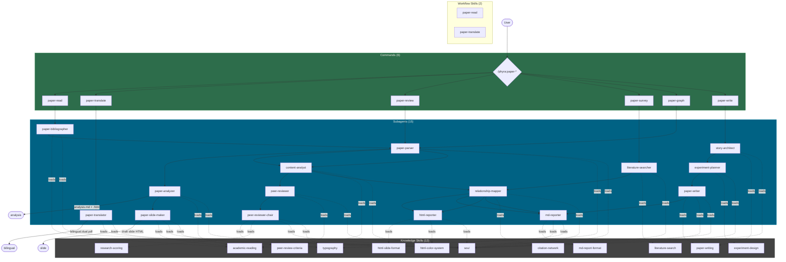

# Phyra

> Phyra draws its name from Epiphyllum, the night-blooming cereus -- a flower that blooms only in darkness and silence, vanishing before dawn. Like its namesake, Phyra is designed to do its work precisely, quietly, with every ounce of effort, and without excess. Though the flower fades, its fragrance lingers.

Maintainer: OrientoNubo
Contact: siyu@cmlab.csie.ntu.edu.tw

## About

Phyra is an academic research plugin for Claude Code, built on collaborative multi-agent architecture. It targets computer science and AI research, with primary support for Computer Vision, Machine Learning, and Deep Learning.

The project is composed of Skills, Subagents, and Commands, providing research assistance with reliability, self-verification, and systematic rigor.

**License:** Apache-2.0 (since v0.4.0; previously CC-BY-NC-4.0). Phyra is an academic, community-oriented project; commercial users are warmly invited to cite the work and consider sponsorship, though commercial use is no longer license-restricted.

## Installation

> After installation, restart Claude Code for changes to take effect.

### Marketplace (Recommended)

```
/plugin marketplace add OrientoNubo/Phyra
/plugin install phyra@phyra
```

> **Troubleshooting:** If you encounter schema validation errors during install, they may come from other installed marketplaces. Run `/plugin marketplace remove claude-plugins-official` first, install Phyra, then re-add the official marketplace.

### Alternative: Plugin Directory

```bash
git clone https://github.com/OrientoNubo/Phyra.git
claude --plugin-dir ./Phyra
```

### Extra setup for `/phyra:paper-translate` (since v0.9.0)

`paper-translate` produces a side-by-side bilingual PDF via BabelDOC, which is not bundled with the plugin (it ships ~340 MB of layout models and CJK fonts). One-time setup:

```bash
uv tool install babeldoc==0.5.24
babeldoc --warmup       # downloads models + fonts to ~/.cache/babeldoc/
```

`uv` itself: `curl -LsSf https://astral.sh/uv/install.sh | sh`. Other Phyra commands (`paper-read`, `paper-review`, `paper-survey`, `paper-graph`, `paper-write`) do not need BabelDOC. (Before v0.9.0, this dependency was attached to `/phyra:paper-read`.)

## Architecture



| Layer | Count | Role |
|---|---|---|
| Skills | 14 (= 12 knowledge + 2 workflow) | Knowledge skills (loaded by agents): reading frameworks, review criteria, scoring rubrics, search strategies, report formats, writing standards, typography, color system. Workflow skills (loaded by commands): `paper-read`, `paper-translate` — multi-step orchestrators rather than knowledge injection. |
| Subagents | 15 | Specialized workers that load skills and execute tasks: parsing, bibliography, analysis (paper-analyzer 5-call split), content-diagnostics (content-analyst), translation (paper-translator), slide-making (paper-slide-maker), reviewing (peer-reviewer × stance + chair), searching, mapping, reporting, writing, planning |
| Commands | 6 | User-facing entry points that orchestrate subagent pipelines |

## Execution Modes

Every command supports two execution modes:

**NT mode (default)** -- Sequential execution. Subagents run one after another in a fixed pipeline.

```
/phyra:paper-review paper.pdf
```

**AT mode (Agent Teams)** -- Parallel execution. Where the workflow allows, subagents run concurrently using Claude Code's Agent Teams feature.

```
/phyra:paper-review --at paper.pdf
```

To enable Agent Teams, add the following to `~/.claude/settings.json`:

```json
{
  "env": {
    "CLAUDE_CODE_EXPERIMENTAL_AGENT_TEAMS": "1"
  }
}
```

### NT vs AT Pipeline Example: /phyra:paper-review

**NT (Sequential):**

```
paper-parser -> content-analyst -> peer-reviewer (constructive) -> peer-reviewer (critical) -> peer-reviewer-chair
```

**AT (Parallel):**

```
paper-parser -> content-analyst -> [peer-reviewer (constructive) || peer-reviewer (critical)] -> peer-reviewer-chair
```

The same `peer-reviewer` agent is spawned twice with distinct stance directives (`constructive` vs `critical`). In AT mode the two stances run in parallel and the chair reconciles disagreements.

## Components

### Commands

#### `/phyra:paper-read`

Systematic paper reading. Always produces a structured Markdown analysis (5-call internal split: overview / sections / critic / method with tensor pipeline / experiments) and a styled HTML viewer for it. Optionally produces a fixed slide-deck draft HTML (rendered from the same Markdown).

```
/phyra:paper-read path/to/paper.pdf
/phyra:paper-read paper.pdf --lang-out zh-CN --at
/phyra:paper-read https://arxiv.org/abs/2505.23884 --no-slide
```

Outputs (alongside the input PDF, or under `<cwd>/.phyra/papers/` for arXiv inputs):
- `<STEM>_analysis.<lang>.md` — comprehensive Markdown analysis
- `<STEM>_analysis.<lang>.html` — viewer HTML with sticky TOC + KaTeX
- `<STEM>_draftslide.html` — fixed slide deck (when `--slide`)

**Pipeline (v0.9.0):** preflight -> paper-bibliographer (BIBLIO.json) -> paper-parser (PARSED_PAPER.md) -> extract_figures -> paper-analyzer (5-call A1..A5 in parallel) -> build_analysis_html -> (optional) paper-slide-maker.

For bilingual translated PDF, see `/phyra:paper-translate` below — it shares the same cache dir, so running both on the same paper reuses parsed metadata.

#### `/phyra:paper-translate`

Side-by-side bilingual translation of an academic paper. Slices off references (cost saving), translates the rest via BabelDOC + Claude headless, then re-injects the original ref pages with a placeholder on the translation side so the final PDF has the same page count as the source.

```
/phyra:paper-translate path/to/paper.pdf
/phyra:paper-translate paper.pdf --lang-out zh-CN --mono
/phyra:paper-translate https://arxiv.org/abs/2503.06132
```

Outputs:
- `<STEM>_bilingual.<lang>.dual.pdf` — side-by-side bilingual
- `<STEM>_bilingual.<lang>.mono.pdf` — translation only (when `--mono`)

**Pipeline (v0.9.0):** preflight -> resolve_input -> (cache lookup for PARSED_PAPER.md) -> paper-translator subagent (slice_pdf -> translate_with_claude -> build_dual).

Requires BabelDOC (one-time `uv tool install babeldoc==0.5.24` + `babeldoc --warmup`). The retry harness sleeps 30 minutes × up to 50 attempts on rate-limit responses.

#### `/phyra:paper-review`

Dual-reviewer peer review with an AC (Area Chair) process. Two independent reviewers (one constructive, one adversarial) each produce a review draft. A chair reconciles disagreements and writes a final peer review report with five-dimension scoring.

```
/phyra:paper-review path/to/paper.pdf
/phyra:paper-review paper.pdf --at
```

**Pipeline:** paper-parser -> content-analyst -> peer-reviewer × 2 (constructive + critical) -> peer-reviewer-chair

#### `/phyra:paper-survey`

Literature search and relationship mapping. Accepts a paper file, text description, task statement, or research topic as input. Searches the literature, analyzes relationships, and produces an HTML report with a force-directed relationship graph alongside a Markdown survey note.

```
/phyra:paper-survey "3D reconstruction from video streams"
/phyra:paper-survey path/to/seed-paper.pdf --at
```

**Pipeline:** literature-searcher -> relationship-mapper -> html-reporter + md-reporter

#### `/phyra:paper-graph`

Citation network and relationship graph from a list of papers. Accepts title lists, BibTeX files, or mixed formats. Analyzes each paper, maps relationships across the entire set, and outputs an interactive HTML visualization and Markdown notes.

```
/phyra:paper-graph paper-list.txt
/phyra:paper-graph references.bib --at
```

**Pipeline:** paper-parser -> content-analyst -> relationship-mapper -> html-reporter + md-reporter

#### `/phyra:paper-write`

End-to-end paper writing assistance, from storyline design through experiment planning to draft writing. Supports both starting from scratch and revising an existing draft.

```
/phyra:paper-write --from-scratch
/phyra:paper-write path/to/draft.tex
/phyra:paper-write draft.md --at
```

**Pipeline:** story-architect -> experiment-planner -> paper-writer -> md-reporter

### Skills

Skills are knowledge modules loaded by subagents. They are not invoked directly by users -- they are automatically loaded when the relevant subagent runs.

| Skill | Description |
|---|---|
| **soul** | Core reasoning philosophy: naturalistic ontology, BSEM aesthetics (Beauty, Simplicity, Elegance, Moderation), care-based ethics. Mandatory for all agents. |
| **typography** | Typography constraints applied to all output: no `——`, no `---` dividers, no 3-level nesting, no decorative bold. |
| **academic-reading** | Systematic paper reading framework (TP-V three-pass method): structure deconstruction, contribution identification, methodology evaluation. |
| **peer-review-criteria** | Peer review evaluation dimensions and flaw classification (Fatal / Major / Minor / Suggestion). |
| **research-scoring** | Five-dimension scoring rubric: Problem Validity (0.15), Method Soundness (0.30), Experimental Adequacy (0.30), Novelty (0.15), Reproducibility (0.10). |
| **literature-search** | Multi-source search strategies across arXiv, Semantic Scholar, Google Scholar, and domain-specific databases. |
| **citation-network** | Relationship type vocabulary (builds-on, contradicts, parallel, supersedes, applies, critiques) and citation graph construction rules. |
| **html-slide-format** | HTML slide report layout and structure specification. |
| **html-color-system** | 100-theme Japanese color palette from nipponcolors.com (42 light + 58 dark), three-layer CSS background, dropdown theme switcher. |
| **md-report-format** | Markdown report templates for each report type (reading notes, survey notes, graph notes, writing plan). |
| **paper-writing** | Academic writing standards: storyline construction, gap analysis, contribution claim formulation. |
| **experiment-design** | Experiment design norms: baseline selection, ablation design, evaluation metrics, hypothesis-driven planning. |

### Subagents

Subagents are specialized workers invoked by commands. They can also be used independently via the `/agents` interface.

| Subagent | Description | Key Skills |
|---|---|---|
| **paper-parser** | Parses PDF / LaTeX / MD / Word papers into structured content. Synchronous first step of all paper-* workflows. | academic-reading |
| **paper-bibliographer** | Extracts basic info, authors with WebSearch-verified affiliations + homepages, related lineage, keywords, research topic, core argument, and the page + label of the main pipeline figure. Output: `BIBLIO.json`. Owned by `/phyra:paper-read`. | academic-reading |
| **paper-analyzer** | Deep, multimodal paper analysis for `/phyra:paper-read`. 5-call internal split (overview / sections / critic / method-with-tensor-pipeline / experiments) producing the full `paper-read-notes` Markdown. Replaces the v0.7 phyra-analyzer / v0.6 deep-extractor + page-annotator chain. | academic-reading |
| **paper-slide-maker** | Renders the analysis Markdown into a fixed slide-deck HTML (keyboard navigation). Pure renderer — no LLM calls. Owned by `/phyra:paper-read`. | academic-reading, html-color-system |
| **paper-translator** | Drives BabelDOC + Claude headless translation (slice refs → translate → re-inject ref placeholders). Owned by `/phyra:paper-translate`. | typography |
| **content-analyst** | Lightweight content-diagnostic agent for `/phyra:paper-review`, `/phyra:paper-graph`, `/phyra:paper-write`. Produces a four-dimension report (claim map / method logic / experiment sufficiency / conclusion overreach). Distinct from `paper-analyzer` — content-analyst is fast and diagnostic, paper-analyzer is deep and full-document. | academic-reading |
| **peer-reviewer** | Stance-parameterised reviewer. Spawned with `stance: constructive` (writes `review-positive.md`, repairability focus) or `stance: critical` (writes `review-negative.md`, root-cause / boundary / novelty focus). Replaces the earlier split peer-reviewer-positive / -negative agents. | peer-review-criteria, research-scoring, academic-reading |
| **peer-reviewer-chair** | AC chair. Reads only review drafts (not the paper), reconciles disagreements, writes the final review and scoring reports. | peer-review-criteria, research-scoring |
| **literature-searcher** | Searches across databases. In AT mode, runs three parallel search strategies (keyword / citation-trace / adjacent-field). | literature-search |
| **relationship-mapper** | Builds pairwise relationship tables and narrative logical threads across paper sets. Must read `citation-network/SKILL.md` before producing output. | citation-network, literature-search |
| **html-reporter** | Produces single-file interactive HTML slide reports with D3.js force-directed graphs and the 100-theme color system. | html-slide-format, html-color-system |
| **md-reporter** | Writes structured Markdown reports from templates. | md-report-format |
| **story-architect** | Designs storylines and contribution frameworks. In AT mode, runs conservative, aggressive, and adversarial instances concurrently. | paper-writing |
| **experiment-planner** | Designs experiments with hypotheses, baselines, ablation plans, and failure-mode analysis. | experiment-design |
| **paper-writer** | Executes paper writing or revision. Never overwrites original files. | paper-writing |

## Token Usage Reference

Approximate wall-clock for the two paper-* commands on a 22-page paper (NT mode; tokens flow through CC auth, no API key needed):

### `/phyra:paper-read` (v0.9.0)

| Stage | Cost |
|---|---|
| paper-bibliographer (with WebSearch verification) | ~60-90 s |
| paper-parser | ~30-60 s |
| extract_figures (PyMuPDF, no LLM) | <1 s |
| paper-analyzer (5-call: A1 OVERVIEW · A2 SECTIONS · A3 CRITIC · A4 METHOD · A5 EXPERIMENTS; parallel in AT mode) | ~3-6 min |
| build_analysis_html (pure renderer) | <1 s |
| paper-slide-maker (pure renderer; only if `--slide`) | <2 s |

End-to-end (analysis only): **~5-8 min wall-clock**. With slide: add ~2 s.

Outputs: `<STEM>_analysis.<lang>.md` (~3000-8000 words for dense papers), `<STEM>_analysis.<lang>.html` (with sticky TOC + KaTeX), and optionally `<STEM>_draftslide.html` (12-22 slides).

### `/phyra:paper-translate` (v0.9.0)

| Stage | Cost |
|---|---|
| preflight (babeldoc + font + gs check) | <1 s |
| slice_pdf (drop refs from translation, save cost) | <1 s |
| translate_with_claude (BabelDOC + per-chunk Claude headless on sliced PDF, ~70% of full page count) | ~5-10 min at `--qps=2` |
| build_dual (re-inject ref pages with placeholder + subset_fonts) | <2 s |

End-to-end: **~5-10 min wall-clock**. Final PDF ~3-6 MB with `--compress=lossy`.

Other commands (`paper-review`, `paper-survey`, `paper-graph`, `paper-write`) follow the v0.3.x token profile and have not changed substantially since.

## Requirements

- Claude Code CLI (latest version recommended)
- For AT mode: Agent Teams enabled in settings
- For `/phyra:paper-read`: `uv` (one-time install; analyzer + slide are pure Python with no other binary deps)
- For `/phyra:paper-translate`: `uv` + `babeldoc==0.5.24` (one-time setup; see Installation above)

## Credits

- Color system: 100-theme Japanese color palette from [nipponcolors.com](https://nipponcolors.com)
